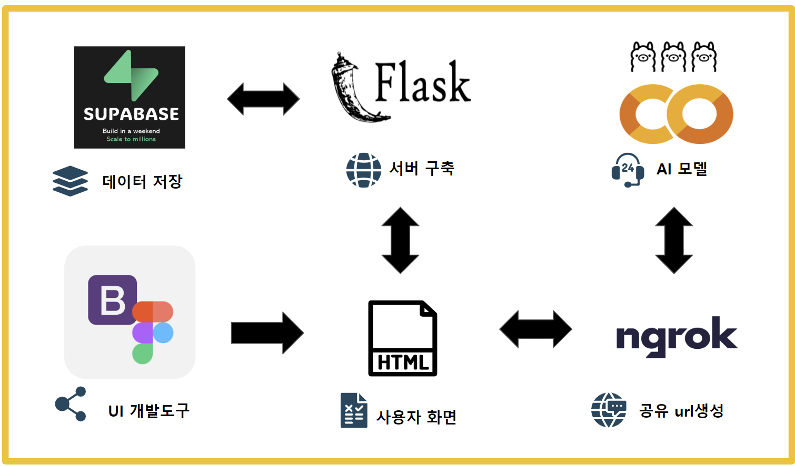
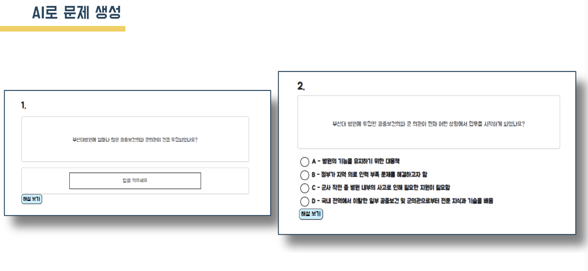
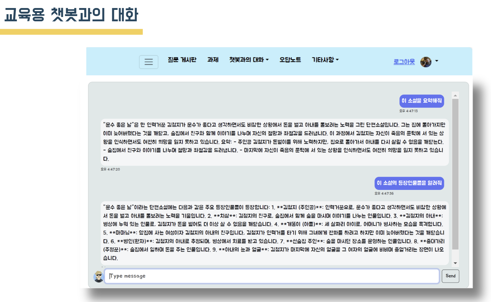

# 챗업스쿨

프로젝트 기간 : 4/1~6/20
디지털 스마트 부산 AI 프로젝트

## 프로젝트 포스터

## 프로젝트 계획
 1. 주제 선정
 2. 필요한 데이터 수집
 3. ai모델 및 웹 페이지 설계
 4. DB설계 및 테스트

## 프로젝트 선정 배경
 - 글로벌 교육 PC와 타블렛 시장의 성장이 늘어남에 따라 교육 환경이 디지털 학습을 통한 환경으로 변함으로써 학습을 더 효율적으로 할 수 있는 교육 서비스가 필요

 - 교육용 챗봇뿐만이 아니라 학생의 감정을 파악하는 감정 파악 챗봇 기능을 제공하여 학생의 교육을 더 향상시킬 수 있도록 하는 CHATUPSCHOOL 서비스를 구상

## 기능 명세
### 일반 공통 기능
    1. 로그인/회원가입/프로필/유저관리  
### 학생
    1. 과목/ 시간표 등록  
    2. 과제 작성  
    3. 질문게시글 작성  
    4. AI 챗봇 채팅 (교육용/일상 대화용)  
    5. 교육자료 다운로드  
    6. 메모  
### 선생
    1. 과목 생성  
    2. AI 문제 생성  
    3. 교육자료 업로드    
    4. 학생 관리  
    5. 질문 게시글 관리  
    6. 학생 감정분석 기록 조회  
  
## 기술 구상도

## llama3 모델과 파인튜닝
 1. 문제 생성과 대화를 위한 한국어 llm 선택  
    https://huggingface.co/allganize/Llama-3-Alpha-Ko-8B-Instruct  

 2. 학습데이터 수집 및 전처리  
    https://aihub.or.kr/aihubdata/data/view.do?currMenu=115&topMenu=100&dataSetSn=86
    https://aihub.or.kr/aihubdata/data/view.do?currMenu=115&topMenu=100&aihubDataSe=data&dataSetSn=71518  
  
 3. 파인튜닝  
    https://github.com/ggerganov/llama.cpp  
      
 4. 평가 및 추론 테스트  
    - 별도의 GPU가 지원되는 서버에서 테스트(colab)    
    - 개인 서버에서 Flask와 Ngrok으로 api접근 기능 구현  
  
  
## 로그인 / 회원등록 기능 / DB
  
- Supabase의 Authentication (구글,카카오 등으로 로그인 연동)  
- 회원, 대시보드 및 파일 데이터는 Supabase DB 이용하여 저장  
- dbconn/model.py에 필요한 data Table을 ORM으로 설계  

## 웹 페이지 디자인
- Figma, Bootstrap을 활용하여 학생용/선생님용 ui 제작  
  
## 웹 서버 구축
- python, Flask, socketio 로 api 제작

## 결과

